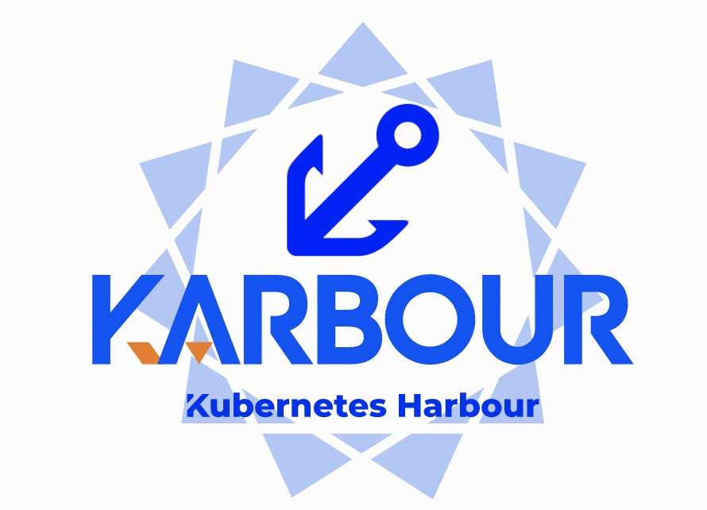

<div align="center">
<p></p><p></p>
<p>
    
</p>
<h1>Search smarter, not harder! ⛵️</h1>

[简体中文](https://github.com/KusionStack/karbour/blob/main/README-zh.md) | [English](https://github.com/KusionStack/karbour/blob/main/README.md) 

[](https://github.com/KusionStack/kusion/actions/workflows/release.yaml)
[](https://github.com/KusionStack/kusion/releases)
[](https://goreportcard.com/report/github.com/KusionStack/kusion)
[](https://coveralls.io/github/KusionStack/kusion)
[](https://pkg.go.dev/github.com/KusionStack/kusion)
[](https://github.com/KusionStack/kusion/blob/main/LICENSE)
<!-- TODO: Uncomment when the repository is publicly. -->
<!-- [](https://github.com/KarbourStack/karbour/actions/workflows/release.yaml) -->
<!-- [](https://github.com/KusionStack/karbour/releases) -->
<!-- [](https://goreportcard.com/report/github.com/KusionStack/karbour) -->
<!-- [](https://coveralls.io/github/KusionStack/karbour) -->
<!-- [](https://pkg.go.dev/github.com/KusionStack/karbour) -->
<!-- [](https://github.com/KusionStack/karbour/blob/main/LICENSE) -->
</div>

# Karbour

Karbour is a search and insight platform for Kubernetes resources. Search smarter, not harder! ⛵️

<!-- ## Key Features -->

<!-- - **App Whole Lifecycle Management**: Manage App from the first code to production-ready with [Karbour](https://github.com/KarbourStack/karbour) and [Konfig](https://github.com/KarbourStack/konfig) -->
<!-- - **Self-Service**: Enable App Dev self-service capabilities and help them cooperate with SRE and Platform Dev efficiently -->
<!-- - **Hybrid Resources Operation**: Orchestrate hybrid runtime resources such as Kubernetes, clouds and customized infrastructures in a unified way -->
<!-- - **Vendor Agnostic**: Write once, render dynamically, deliver to any cloud -->

<!-- <div align="center"> -->

<!--  -->
<!-- </div> -->

## Quick Start
Visit [Quick Start](https://karbour.com/docs/user_docs/getting-started) to deliver an App with one Karbour command

## Installation

### Homebrew (macOS & Linux)

```shell
brew install KusionStack/tap/karbour
```

### Go Install

```shell
go install github.com/KusionStack/karbour@latest
```

### Docker

```
docker pull kusionstack/karbour:latest
```

> For more information about installation, please check the [Installation Guide](https://karbour.com/docs/user_docs/getting-started/install) on Karbour official website

# Contact Us
- Twitter: [KusionStack](https://twitter.com/KusionStack)
<!-- - Slack: [Kusionstack](https://join.slack.com/t/karbour/shared_invite/zt-19lqcc3a9-_kTNwagaT5qwBE~my5Lnxg) -->
<!-- - DingTalk (Chinese): 42753001 -->
<!-- - Wechat Group (Chinese) -->

  <!--  -->


# 🎖︎ Contribution Guide

Karbour is still in the initial stage, and there are many capabilities that need to be made up, so we welcome everyone to participate in construction with us. Visit the [Contribution Guide](CONTRIBUTING.md) to understand how to participate in the contribution Karbour project. If you have any questions, please [Submit the Issue](https://github.com/KusionStack/karbour/issues).
