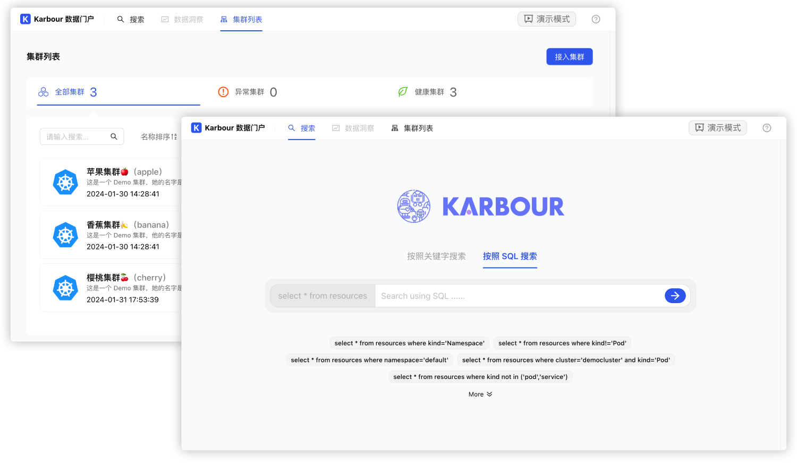

<div align="center">
<p></p><p></p>
<p>
    
</p>
<h1>Search smarter, not harder! ⛵️</h1>

[简体中文](https://github.com/KusionStack/karbour/blob/main/README-zh.md) | [English](https://github.com/KusionStack/karbour/blob/main/README.md)

[](https://github.com/KusionStack/kusion/actions/workflows/release.yaml)
[](https://github.com/KusionStack/kusion/releases)
[](https://goreportcard.com/report/github.com/KusionStack/kusion)
[](https://coveralls.io/github/KusionStack/kusion)
[](https://pkg.go.dev/github.com/KusionStack/kusion)
[](https://github.com/KusionStack/kusion/blob/main/LICENSE)

<!-- TODO: Uncomment when the repository is publicly. -->

<!-- [](https://github.com/KarbourStack/karbour/actions/workflows/release.yaml) -->

<!-- [](https://github.com/KusionStack/karbour/releases) -->

<!-- [](https://goreportcard.com/report/github.com/KusionStack/karbour) -->

<!-- [](https://coveralls.io/github/KusionStack/karbour) -->

<!-- [](https://pkg.go.dev/github.com/KusionStack/karbour) -->

<!-- [](https://github.com/KusionStack/karbour/blob/main/LICENSE) -->

</div>

# Karbour

Karbour is a **Multi-Cluster Kubernetes Data Plane focusing on Search and Insight**. Search smarter, not harder! ⛵️



## Key Features

-   `Karbour` runs on compute as low as $15/month.
-   Lightweight and easy to setup. One `helm` is done.
-   Self-hosted - Cost-effective, bring your own server, scale when you need.
-   Read only data plane, non-invasive to user cluster.

<!-- - HTTPS/TLS out-of-the-box with auto generated [Let's Encrypt](https://letsencrypt.org/) certificates. -->

## Quick Start

## Installation

### Homebrew (macOS & Linux)

```shell
brew install KusionStack/tap/karbour
```

### Go Install

```shell
go install github.com/KusionStack/karbour@latest
```

### Docker

```
docker pull kusionstack/karbour:latest
```

> For more information about installation, please check the [Installation Guide](https://karbour.com/docs/user_docs/getting-started/install) on Karbour official website

# Contact Us

-   Twitter: [KusionStack](https://twitter.com/KusionStack)

<!-- - Slack: [Kusionstack](https://join.slack.com/t/karbour/shared_invite/zt-19lqcc3a9-_kTNwagaT5qwBE~my5Lnxg) -->

<!-- - DingTalk (Chinese): 42753001 -->

<!-- - Wechat Group (Chinese) -->

  <!--  -->

# 🎖︎ Contribution Guide

Karbour is still in the initial stage, and there are many capabilities that need to be made up, so we welcome everyone to participate in construction with us. Visit the [Contribution Guide](CONTRIBUTING.md) to understand how to participate in the contribution Karbour project. If you have any questions, please [Submit the Issue](https://github.com/KusionStack/karbour/issues).
