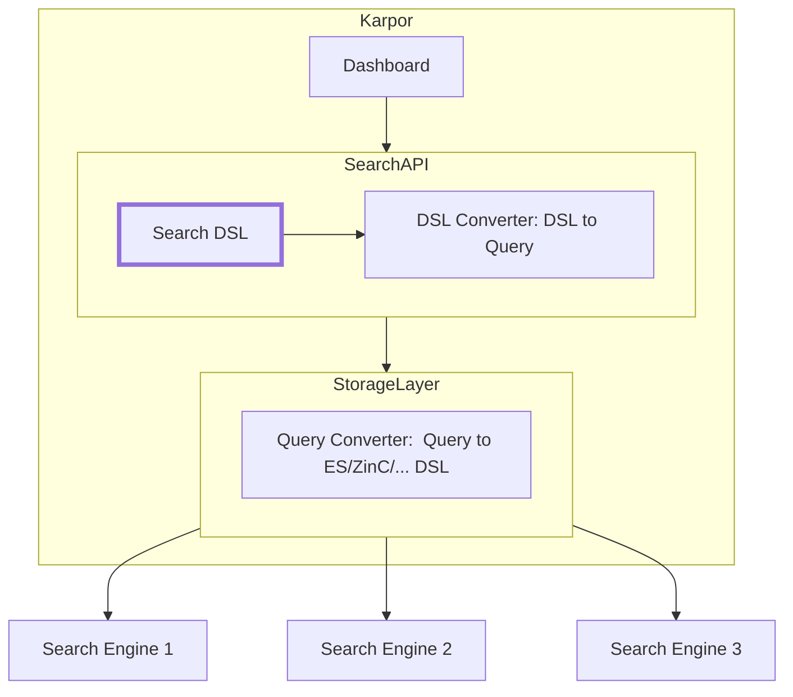

# Abstract

This article presents two search languages designed to retrieve the resources, and compares their advantages and disadvantages.

# Motivation

Enabling the retrieval of resources from multiple clusters is a crucial functionality of Karpor. However, the current search feature is relatively basic, only supporting keyword and content searches. To provide a more comprehensive search capability, it is necessary to design a dedicated DSL for searching.

# Proposal

## Dos

* User-friendliness: Minimize the learning and usage costs for users. Most search statements should have a simple structure and be achievable in a single line.
* Rich functionality: Support searches with multiple keywords and content, and provide operations such as AND, OR, NOT, and regular expressions.
* Maintain versatility: Strive to incorporate industry best practices as much as possible, avoiding reinventing the wheel.

## Don'ts

* Focus solely on syntax design without providing specific implementations.
* Omit discussions on how the matching results should be displayed.

## Design

## Overall Process

The overall process is as shown in the following diagram: 
1. The user enters the Search DSL on the search interface.
2. The search interface calls the Search API.
3. The backend converts the Search API into an internal query format.
4. The storage layer converts it into a specific query statement (e.g., Elasticsearch query).



## Solution Design

This section describes the syntax and description of the search patterns that Karpor plans to support for retrieving resource content.

### Solution 1: Using DSL for Search

#### Content Search

Content search is used to match against the content of resources. It uses `"..."` for exact matching and `/.../` for regular expression matching.

| Syntax        | Description                                     |
|---------------|-------------------------------------------------|
| `foo`         | Match the string `foo` exactly                  |
| `"foo bar"`   | Match the string `foo bar` exactly              |
| `/foo.*bar/`  | Match regular expression `foo.*bar`             |
| `foo AND bar` | Match resources containing both `foo` and `bar` |

#### Keyword search

Keyword search is used to match against keywords.

| Syntax                 | Description                                                                            | Example                                                                                                   |
|------------------------|----------------------------------------------------------------------------------------|-----------------------------------------------------------------------------------------------------------|
| `key:"pattern"`        | Matching resources with `key` as `pattern`.                                            | `cluster:"foo"` is used to match resources with `cluster` equals to `foo` using exact matching.           |
| `key:/regexp-pattern/` | Matching resources with `key` matching the regular expression pattern `regexp-pattern` | `cluster:"foo*"` is used to match resources with `cluster` matching the regular expression pattern `foo*` |

Supporting keywords:

* Match query: `cluster`,`apiVersion`, `group`, `version`, `kind`, `group`,`namespace`,`name`.
* Full text query: `content`, `label`,`label.key`,`label.val`,`annotation`,`annotation.key`,`annotation.val`.

#### Boolean operators

Multiple expressions can be connected using boolean operators.

| Operator        | Description                                                       | Example                                                 |
|-----------------|-------------------------------------------------------------------|---------------------------------------------------------|
| `NOT exp1`      | Excluding resources matched by `exp`.                             | `NOT cluster:"cluster1"`                                |
| `exp1 AND exp2` | Selecting resources that simultaneously match `exp1` and `exp2`.  | `cluster:"cluster1" AND version:"v1"`                   |
| `exp1 OR exp2`  | Selecting resources that match either `exp1` or `exp2`.           | `cluster:"cluster1" OR cluster:"cluster2"`              |
| `(` `)`         | Modifying the association order of expressions using parentheses. | `(name:"name1" OR name:"name2") AND cluster:"cluster1"` |

### Solution 2: Using SQL for Search

#### Mapping concepts across SQL and Elasticsearch

| SQL    | Elasticsearch | Description                                                                                                                                                                                                                                                                                                                                                                                                                                                                                                           |
|--------|---------------|-----------------------------------------------------------------------------------------------------------------------------------------------------------------------------------------------------------------------------------------------------------------------------------------------------------------------------------------------------------------------------------------------------------------------------------------------------------------------------------------------------------------------|
| column | field         | In both cases, at the lowest level, data is stored in named entries, of a variety of data types, containing one value. SQL calls such an entry a column while Elasticsearch a field. Notice that in Elasticsearch a field can contain multiple values of the same type (essentially a list) while in SQL, a column can contain exactly one value of said type. Elasticsearch SQL will do its best to preserve the SQL semantic and, depending on the query, reject those that return fields with more than one value. |
| row    | document      | Columns and fields do not exist by themselves; they are part of a row or a document. The two have slightly different semantics: a row tends to be strict (and have more enforcements) while a document tends to be a bit more flexible or loose (while still having a structure).                                                                                                                                                                                                                                     |
| table  | index         | The target against which queries, whether in SQL or Elasticsearch get executed against.                                                                                                                                                                                                                                                                                                                                                                                                                               |

#### Synopsis of SQL

```sql
SELECT [TOP [ count ] ] select_expr [, ...]
[ FROM table_name ]
[ WHERE condition ]
[ GROUP BY grouping_element [, ...] ]
[ HAVING condition]
[ ORDER BY expression [ ASC | DESC ] [, ...] ]
[ LIMIT [ count ] ]
[ PIVOT ( aggregation_expr FOR column IN ( value [ [ AS ] alias ] [, ...] ) ) ]
```

* Supporting table: `resources`.
* Supporting columns: `content`,`cluster`,`apiVersion`, `group`, `version`, `kind`, `namespace`,`name`,`label`,`label.key`,`label.val`,`annotation`,`annotation.key`,`annotation.val`.

Example:

Match exactly:

```sql
SELECT * from resources WHERE cluster=tes1
```

Full text query:

```sql
SELECT * from resources WHERE content CONTAINS 'test1'
```

## Solution Comparison

| Solution | Advantages                                     | Disadvantages                                         |
|----------|------------------------------------------------|-------------------------------------------------------|
| DSL      | Simple searches are easier to get started with | Complex searches require learning the relevant syntax |
| SQL      | No need to learn an additional search language | Writing simple searches can sometimes be more verbose |

# Reference
* [Search query syntax - Sourcegraph docs](https://docs.sourcegraph.com/code_search/reference/queries)
* [Understanding GitHub Code Search syntax - GitHub Docs](https://docs.github.com/en/search-github/github-code-search/understanding-github-code-search-syntax)
* [Query DSL | Elasticsearch Guide [8.10] | Elastic](https://www.elastic.co/guide/en/elasticsearch/reference/current/query-dsl.html)
* [Basic Editing in Visual Studio Code](https://code.visualstudio.com/docs/editor/codebasics#_advanced-search-options)
* [SQL | Elasticsearch Guide [8.10] | Elastic](https://www.elastic.co/guide/en/elasticsearch/reference/current/xpack-sql.html)
* [Pulumi Insights: Resource search | Pulumi Docs](https://www.pulumi.com/docs/pulumi-cloud/insights/search/)
